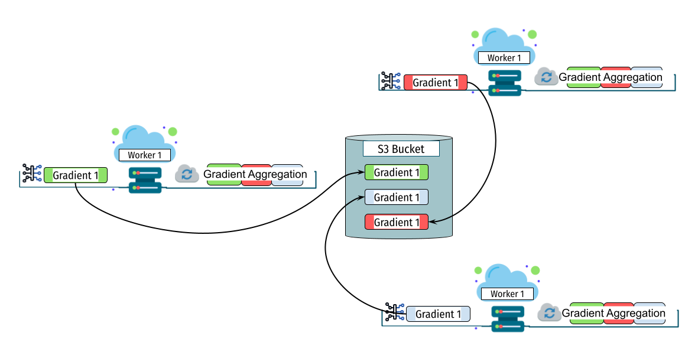

# A Comparative Study of CPU-Based Serverless and GPU Based Training Architectures

## Introduction to Serverless Computing
Serverless computing has revolutionized the way distributed machine learning (ML) tasks are performed by eliminating the need for managing servers and allowing developers to focus purely on code. This document explores various serverless frameworks that have been specifically designed to enhance distributed ML tasks in a serverless environment.

## Frameworks Description

### SPIRT


SPIRT operates on a peer-based system where each worker maintains its own database and a serverless workflow orchestrated by AWS Step Function. The workflow encompasses:
1. Fetching minibatches.
2. Parallel gradient computation.
3. Storing gradients in the worker's database.
4. Averaging gradients within the database.
5. Notifying completion via a synchronization queue.
6. Polling the synchronization queue.
7. Retrieving averaged gradients from peer databases.
8. Aggregating these averages.
9. Updating local models.

### MLLESS


In MLLESS, the workflow includes:
1. Fetching a minibatch.
2. Computing the gradient.
3. Storing significant gradients in a shared database.
4. Monitoring queues for updates.
5. Waiting for all updates as communicated by the supervisor.
6. Fetching and aggregating the corresponding gradients.
7. Updating the model with the aggregated gradients.

### ScatterReduce-LambdaML


This approach involves:
1. Fetching minibatches.
2. Computing gradients.
3. Dividing and distributing gradient chunks.
4. Fetching and aggregating assigned chunks.
5. Sending aggregated chunks back to the database.
6. Retrieving and concatenating all aggregated chunks.
7. Updating the model with the complete gradient.

### AllReduce-LambdaML


The AllReduce-LambdaML framework proceeds as follows:
1. Fetching a minibatch.
2. Computing gradients.
3. Sending gradients to a shared database.
4. Aggregating all gradients into a single unified gradient (performed by a designated master worker).
5. Sending the aggregated gradient back to the database.
6. Each worker updates their local models with the aggregated gradient.

### GPU-Based Baseline



The GPU-based training framework proceeds as follows:

1. Fetching a minibatch.
2. Transferring the minibatch to GPU memory.
3. Executing the forward propagation on the GPU to compute predictions.
4. Performing the backward propagation on the GPU to calculate gradients.
5. Updating the model parameters directly on the GPU via the optimizer.
6. Logging metrics (e.g., loss, accuracy) and proceeding to the next minibatch.

## Execution of the Frameworks:
This works was implemeted within AWS plateform.
### AWS Lambda Layers Configuration
This section provides a configuration setup for AWS Lambda Layers. Lambda functions require libraries and dependencies to fulfill their functionalities. This posed challenges due to AWS Lambda’s deployment package size limitations. These packages must adhere to a 50 MB limit when compressed, with the uncompressed file size not exceeding 250 MB. In contrast, ARM-based layers inherently offer a reduced size. To facilitate seamless deployment on our custom ARM architecture, we packaged ML dependencies, including the Pytorch library, in a zip file. In cases where additional dependencies are necessary, they can be seamlessly integrated as separate layers within the AWS Lambda service.

To use the provided Lambda layers, follow these steps to download and integrate them into your AWS Lambda function:

1. Navigate to the Lambda Layers Directory:
   ```bash
   cd TrainingML_P2P_Serverless/Lambda_Layers
   ```

2. Download the Required Layers:
   ```bash
   # Example: Download a specific layer (replace 'your_layer.zip' with the actual file name)
   wget https://github.com/AmineBarrak/TrainingML_P2P_Serverless/raw/main/Lambda_Layers/your_layer.zip
   ```

3. Upload Layers to AWS Lambda:
   Use the AWS CLI or AWS Management Console to upload the downloaded ZIP file as a new layer in Lambda.
   ```bash
   aws lambda publish-layer-version --layer-name "YourLayerName" --zip-file fileb://your_layer.zip --compatible-architectures "arm64"
   ```

 
 

### SPIRT Setup

#### Lambda Functions
The directory **'TrainingML_P2P_Serverless/SPIRT/Functions/'** contains a collection of AWS Lambda functions specifically designed to handle the workflow of a peer-to-peer (P2P) machine learning training process on a serverless architecture. Each function plays a critical role in various stages of the ML model lifecycle, from initialization through training to convergence checks.

#### Lambda Functions Overview
1. init_peers: Initializes RSA key pairs and signatures for peer verification.
2. init_model: Standardizes model initialization across peers and starts the AWS Step Function for training.
3. Auth: Verifies signatures from peers and manages their inclusion in the network.
4. compute_gradients: Computes gradients for all batches.
5. Trigger_Average_Gradient_sync: Averages gradients within the database.
6. check_heartbeat: Monitors the health of peers' databases for fault tolerance.
7. Aggregation: Gathers and aggregates gradients from all peers.
8. Trigger_update_model: Triggers updates to the local model in the database.
9. check-convergence: Checks for model convergence to finalize training.
10. Update_Trigger_Next_epoch: Triggers the next training epoch via a new AWS Step Function.

To deploy these Lambda functions, follow these steps:

1. Navigate to the Functions Directory:
Change into the directory containing the Lambda functions.
<pre> cd TrainingML_P2P_Serverless/SPIRT/Functions </pre>

2. Create Lambda Functions in AWS:
For each function, use the AWS CLI to create a new Lambda function. Below is an example command to create one Lambda function. Repeat this for each script.

<pre>  aws lambda create-function --function-name init_peers \
                           --runtime python3.8 \
                           --role [Role-ARN] \
                           --handler init_peers.lambda_handler \
                           --zip-file fileb://init_peers.zip \
                           --timeout 15 \
                           --memory-size 128</pre>  
Note: Replace '[Role-ARN]' with the actual ARN of your IAM role that has Lambda execution permissions. Ensure each function's handler and file name is correctly specified.

#### AWS Step Functions
For the orchestration of various tasks within the training process, we utilize AWS Step Functions. A dynamic state machine is initiated for each training epoch, coordinating tasks such as gradient computations and model updates. The state machine is defined in JSON format, which outlines the sequence of tasks and the conditions for transitions between states. Each state within the machine corresponds to a specific Lambda function, ensuring a structured and automated workflow for the machine learning training process.

To generate the JSON description of the state machine and to execute it specifying the number of batches, follow these steps:

1. Navigate to the following directory:

<pre>cd TrainingML_P2P_Serverless/SPIRT/Step_Function/ </pre>

2. Run the Script:
Execute the script with the desired number of batches. For example, to create a state machine for five batches:

<pre> python create_step_function.py --batches 5  </pre>

3. Create the State Machine in AWS Step Functions:
Use the JSON output from the script to create a state machine in AWS Step Functions via the AWS Management Console or the AWS CLI.

4. Assign IAM Roles:
Ensure that the IAM roles associated with the state machine have the necessary permissions to invoke the Lambda functions.


#### RedisAI Configuration with Deployment on AWS EC2

Following this, we compiled the RedisAI module with enhanced capabilities using these steps:

<pre> Clear any previous builds: make -C opt clean ALL=1 </pre>

<pre> Build the module: make -C opt </pre>

The current version is compiled, you do not need to compile again, unless you want to add more features.

To deploy RedisAI on an AWS EC2 instance, you would first need to set up an EC2 instance on Amazon Web Services. Ensure that Redis is installed on the EC2 instance. You also need to copy the downloaded RedisAI source code from your repository to the EC2 server.

To integrate the RedisAI module when initiating the Redis server, utilize the `--loadmodule` command line option and provide the accurate path to the module’s library, as shown below:

<pre> redis-server --port 6380 --loadmodule ./bin/linux-x64-release/src/redisai.so </pre>

We have added new functionality to RedisAI that allows the updating of model parameters directly within the database environment. The new command provided by RedisAI for updating model parameters directly in Redis is as follows:

<pre> AI.ModelUpdate Params key Lr Grads key </pre>   
Parameters:

* Params key: The key in Redis where the model parameters are stored.
* Lr: Learning rate to be applied during the update.
* Grads key: The key where the gradients are stored that will be used to update the model. 

This setup allows you to manage and update your AI models directly on your EC2 instance, leveraging the power and flexibility of cloud computing with AWS.


### MLLESS Setup

The MLLESS framework can be deployed with or without a significant update. Follow these instructions based on your specific requirements:

1. **Choosing the Deployment Type**
   - For deployments with a significant update, use the files located in: `./Replication/Mlless_replication/MLLESS_significant_update`.
   - For deployments without a significant update, use the files located in: `./Replication/Mlless_replication/MLLESS_non_significant`.

2. **Lambda Function Deployment**
   - **Server Function:**
     - Deploy all the content from the appropriate server folder in the `MLLESS_significant_update` or `MLLESS_non_significant` path to a new Lambda function named 'Server'.
   - **Worker Function:**
     - Similarly, deploy all the content from the appropriate worker folder to a new Lambda function named 'Worker'.

3. **Automated Parallel Triggering**
   - **Server:**
     - Use the `trigger_server.py` script to manually or automatically trigger the server function.
   - **Worker:**
     - Use the `trigger_worker.py` script to trigger parallel worker functions. Modify the number of workers within the script as needed to match your deployment's scale.


### ScatterReduce-LambdaML Setup
To deploy and run the ScatterReduce framework, please follow these instructions:

1. **Prepare Files for Lambda Function**
   - Locate the required files within the folder: `./Replication/ScatterReduce_replication`.
   - Upload these files to a new Lambda function in your cloud environment.

2. **Lambda Function Deployment**
   - Create a Lambda function and ensure that all files from the `./Replication/ScatterReduce_replication` folder are included as the source code for the function.

3. **Add Required Layers**
   - The Lambda function requires specific layers to execute properly. Ensure to add the following layers:
     - `numpy` - For numerical operations.
     - `torch` - For machine learning computations.
     - `PIL` (Pillow) - For image processing capabilities.

4. **Executing the Lambda Function**
   - Trigger the Lambda function using the following event structure:
     ```python
     event_data = {
         "data_bucket": "your-bucket-name-here",
         "rank": rank,  # Worker index for this process
         "num_workers": num_workers  # Total number of workers
     }
     ```
   - Replace `"your-bucket-name-here"` with the actual name of your data bucket, and set the `rank` and `num_workers` as per your specific use case.

5. **Automated Parallel Triggering**
   - To trigger the Lambda function in parallel for multiple workers automatically, use the `trigger_scatter_reduce.py` script.
   - This script helps manage and automate the triggering process for all Lambda instances concurrently, ensuring efficient parallel execution.


### AllReduce-LambdaML Setup

To set up and run the ALLreduce framework, follow these steps:

1. **Lambda Function Deployment**
   - Navigate to the source code located at: `./Replication/AllReduce_replication/lambda_function.py`.
   - Create a new Lambda function in your cloud environment and upload this file as the source code.

2. **Add Required Layers**
   - The Lambda function requires the following layers to execute properly:
     - `numpy` - A fundamental package for scientific computing with Python.
     - `torch` - An open-source machine learning library.
     - `PIL` (Pillow) - A Python Imaging Library adds image processing capabilities to your Python interpreter.

3. **Executing the Lambda Function**
   - Trigger the Lambda function using the following event structure:
     ```python
     event_data = {
         "data_bucket": "your-bucket-name-here",
         "rank": rank,  # Worker index for this process
         "num_workers": num_workers  # Total number of workers
     }
     ```
   - Replace `"your-bucket-name-here"` with the actual name of your data bucket, and set the `rank` and `num_workers` as per your specific use case.

4. **Automated Parallel Triggering**
   - To trigger the Lambda function in parallel for multiple workers automatically, use the `trigger_all_reduce.py` script.
   - This script facilitates managing and automating the triggering process for all Lambda instances concurrently, ensuring efficient parallel execution.


Here's the updated version with your preferred instruction style:

---

### GPU-Based Setup

To run the GPU-based training baseline, follow these steps:

1. **Launch a GPU Instance**

   * Use a GPU-enabled instance (e.g., `g4dn.xlarge` on AWS EC2).
   * Make sure Python 3.8+ is installed.

2. **Install Required Packages**

   * Install the following packages:

     ```bash
     pip install torch torchvision boto3 pillow
     ```

3. **Prepare the Training Script**

   * Script location: `./Replication/GPU_base_replication/train_worker.py`

4. **S3 Configuration**

   * Make sure your AWS credentials are configured:

     ```bash
     aws configure
     ```
   * In the `train_worker.py` script, **replace the S3 bucket name** with your own bucket name where the dataset or logs are stored.

5. **Run the Training**

   * Execute the script with:

     ```bash
     python train_worker.py
     ```


  


